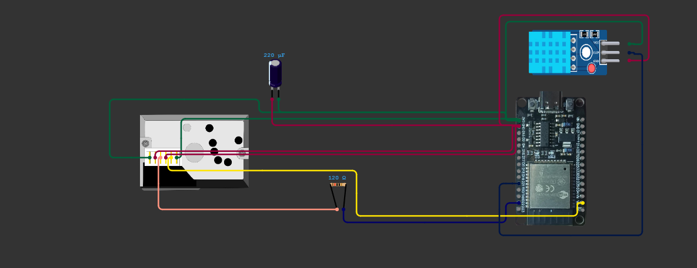
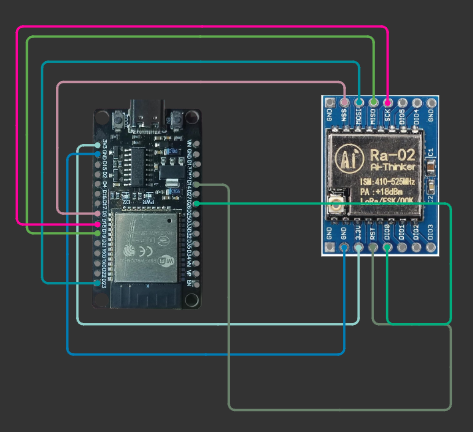
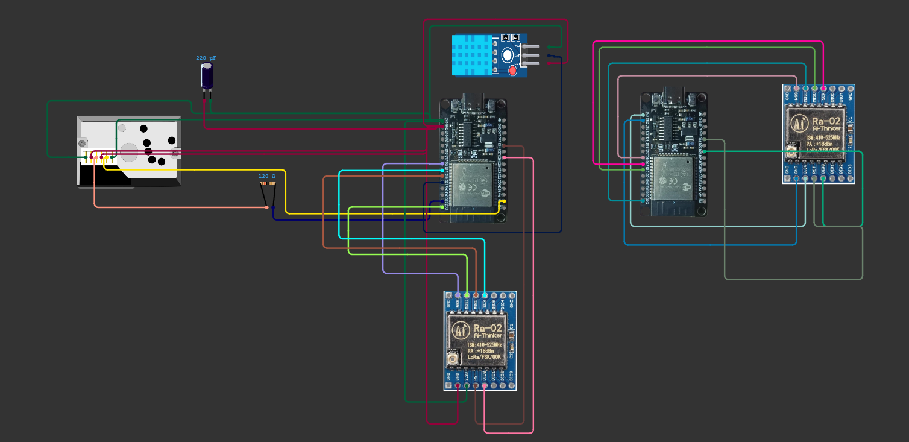
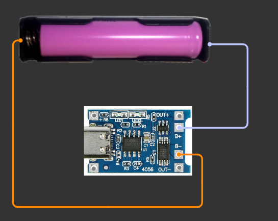
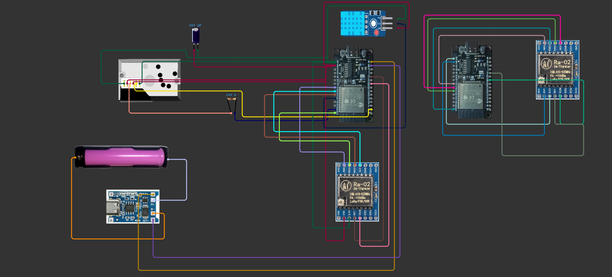

# 🔌 Circuit Diagrams

This folder contains all the hardware circuit diagrams used in the project. Each circuit represents a specific subsystem of the environmental monitoring node and was designed using **Circuit Designer**.

The documentation below explains the purpose of each circuit, its pin connections, components used, and how it works.

You Can Access the whole Circuit [here](https://app.cirkitdesigner.com/project/72f4accd-b4bb-4687-a699-8c45e1bc3c0c)
---

# 📚 Quick Navigation

| Circuit | Documentation | Circuit Image |
|---------|---------------|---------------|
| Circuit 1 – Sensor Node | [Jump](#circuit-1--sensor-node) | [View Image](./01_Dht11_Pm2.5.png) |
| Circuit 2 – LoRa Receiver | [Jump](#circuit-2--lora-receiver) | [View Image](./02_Lora_reciever.png) |
| Circuit 3 – LoRa Transmitter | [Jump](#circuit-3--lora-transmitter) | [View Image](./03_Dht11+PM2.5+Lora_Reciever+Lora_Transmitter.png) |
| Circuit 4 – TP4056 Power Module | [Jump](#circuit-4--tp4056-battery-charging-module) | [View Image](./04_tp4056_42.png) |
| Circuit 5 – Complete Circuit | [Jump](#circuit-5--complete-hardware-circuit) | [View Image](./05_Complete_Circuit.png) |

---

# 📁 Directory Structure

```text
docs/
└── circuit/
    ├── 01_Dht11_Pm2.5.png
    ├── 02_Lora_reciever.png
    ├── 03_Dht11+PM2.5+Lora_Reciever+Lora_Transmitter.png
    ├── 04_tp4056_42.png
    ├── 05_Complete_Circuit.png
    └── Readme.md
```

## Files

| File | Description |
|------|-------------|
| **01_Dht11_Pm2.5.png** | ESP32 connected to the DHT11 and GP2Y1014AU0F sensors. |
| **02_Lora_reciever.png** | Standalone LoRa receiver node using ESP32. |
| **03_Dht11+PM2.5+Lora_Reciever+Lora_Transmitter.png** | Main sensing node with the LoRa transmitter connected. |
| **04_tp4056_42.png** | TP4056 charging circuit with Li-ion battery. |
| **05_Complete_Circuit.png** | Final integrated hardware circuit. |
| **Readme.md** | Documentation for all hardware circuits. |

---

# Circuit 1 – Sensor Node

📷 **View Full Circuit:** [01_Dht11_Pm2.5.png](./01_Dht11_Pm2.5.png)



## Purpose

This is the primary sensing circuit responsible for collecting environmental data.

## Components Used

- ESP32 DevKit V1
- DHT11
- GP2Y1014AU0F
- 120 Ω Resistor
- 150 Ω Resistor
- 220 µF Capacitor

## Pin Connections

### DHT11

| Pin | ESP32 |
|------|--------|
| VCC | 3.3V |
| GND | GND |
| DATA | GPIO4 |

### GP2Y1014AU0F

| Sensor Pin | ESP32 |
|-------------|--------|
| Pin 1 | 5V |
| Pin 2 | GND through 150 Ω resistor |
| Pin 3 | GPIO27 |
| Pin 4 | GPIO34 |
| Pin 5 | GND |
| Pin 6 | 5V |

### Passive Components

| Component | Connection |
|-----------|------------|
|120 Ω Resistor|Connected as shown in the circuit diagram|
|220 µF Capacitor (+)|5V|
|220 µF Capacitor (-)|GND|

## How It Works

1. ESP32 powers both sensors.
2. DHT11 measures temperature and humidity.
3. GP2Y1014AU0F measures PM2.5 concentration.
4. ESP32 processes the sensor values.
5. Data is prepared for LoRa transmission.

---

# Circuit 2 – LoRa Receiver

📷 **View Full Circuit:** [02_Lora_reciever.png](./02_Lora_reciever.png)



## Purpose

Receives wireless sensor data transmitted by the sensing node.

## Components Used

- ESP32 DevKit V1
- SX1278 LoRa Module

## Pin Connections

| LoRa Pin | ESP32 |
|----------|--------|
|VCC|3.3V|
|GND|GND|
|SCK|GPIO18|
|MISO|GPIO19|
|MOSI|GPIO23|
|NSS (CS)|GPIO5|
|RESET|GPIO14|
|DIO0|GPIO26|

## How It Works

1. ESP32 initializes the LoRa module.
2. LoRa continuously listens for incoming packets.
3. Received packets are decoded.
4. ESP32 forwards the received data to the web dashboard.

---

# Circuit 3 – LoRa Transmitter

📷 **View Full Circuit:** [03_Dht11+PM2.5+Lora_Reciever+Lora_Transmitter.png](./03_Dht11+PM2.5+Lora_Reciever+Lora_Transmitter.png)



## Purpose

Adds long-range wireless communication to the sensor node.

## Components Used

- ESP32 DevKit V1
- SX1278 LoRa Module

## Pin Connections

| LoRa Pin | ESP32 |
|----------|--------|
|VCC|3.3V|
|GND|GND|
|SCK|GPIO18|
|MISO|GPIO19|
|MOSI|GPIO23|
|NSS (CS)|GPIO5|
|RESET|GPIO14|
|DIO0|GPIO26|

## How It Works

1. ESP32 reads sensor values.
2. Data is packed into a LoRa packet.
3. The LoRa module transmits the packet.
4. The receiver node collects the transmitted data.

> **Note:** The transmitter and receiver use the same SPI pin configuration.

---

# Circuit 4 – TP4056 Battery Charging Module

📷 **View Full Circuit:** [04_tp4056_42.png](./04_tp4056_42.png)



## Purpose

Provides battery charging and power management for the entire system.

## Components Used

- TP4056 Charging Module
- 3.7V Li-ion Battery
- Battery Holder

## Pin Connections

### Battery

| TP4056 | Connection |
|---------|------------|
|B+|Battery Positive (+)|
|B-|Battery Negative (-)|

### Output

| TP4056 | Connected To |
|---------|--------------|
|OUT+|ESP32 VIN / 5V|
|OUT-|ESP32 GND|

### Input

| TP4056 | Connected To |
|---------|--------------|
|IN+|USB 5V|
|IN-|USB GND|

## How It Works

1. USB powers the TP4056.
2. The battery charges safely.
3. Battery power is supplied to the ESP32.
4. Protection circuitry prevents battery damage.

---

# Circuit 5 – Complete Hardware Circuit

📷 **View Full Circuit:** [05_Complete_Circuit.png](./05_Complete_Circuit.png)



## Purpose

Shows the complete hardware implementation of the environmental monitoring system.

## Components Used

- ESP32 DevKit V1
- DHT11
- GP2Y1014AU0F
- SX1278 LoRa Module
- TP4056
- Li-ion Battery
- 120 Ω Resistor
- 150 Ω Resistor
- 220 µF Capacitor

## ESP32 Pin Summary

| ESP32 Pin | Connected Device |
|-----------|------------------|
|3.3V|DHT11, LoRa|
|5V|GP2Y1014AU0F|
|GND|All Modules|
|GPIO4|DHT11 DATA|
|GPIO27|GP2Y LED Control|
|GPIO34|GP2Y Analog Output|
|GPIO18|LoRa SCK|
|GPIO19|LoRa MISO|
|GPIO23|LoRa MOSI|
|GPIO5|LoRa NSS|
|GPIO14|LoRa RESET|
|GPIO26|LoRa DIO0|
|VIN|TP4056 OUT+|

## How It Works

1. TP4056 powers the ESP32 using a rechargeable battery.
2. ESP32 reads the DHT11 and PM2.5 sensor.
3. Sensor readings are processed locally.
4. LoRa transmits the data.
5. Receiver ESP32 receives the packet.
6. The received data is displayed on the web dashboard.

---

# 🔄 Hardware Flow

```text
          Li-ion Battery
                 │
                 ▼
             TP4056 Module
                 │
                 ▼
            ESP32 DevKit V1
        ┌────────┼─────────┐
        │        │         │
        ▼        ▼         ▼
     DHT11    GP2Y1014    LoRa
        │        │         │
        └────────┴─────────┘
                 │
          LoRa Wireless Link
                 │
                 ▼
         ESP32 + LoRa Receiver
                 │
                 ▼
          Web Dashboard
```

---

# 📝 Important Notes

- All modules must share a **common GND**.
- The LoRa module operates at **3.3V only**.
- The GP2Y1014AU0F requires a **150 Ω resistor** and **220 µF capacitor** for stable operation.
- The **120 Ω resistor** should be connected exactly as shown in the circuit diagram.
- Verify all wiring before applying power.
- Test each module individually before assembling the complete system.